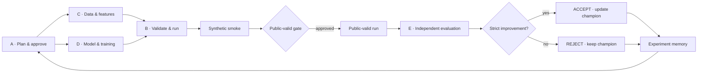

# BOB-Agent

**A safety-gated five-agent platform for reproducible recommender-system experiments.**

BOB-Agent turns a recommendation experiment into a reviewable workflow: propose one
hypothesis, implement it within a role boundary, run a bounded synthetic check,
train on public validation data only after an explicit gate, evaluate independently,
accept or reject the result, and retain the best verified champion.

The project addresses a practical failure mode in recommender-system research:
iterations are slow, experimental roles blur together, leakage is easy, and a
regressing model can look attractive when provenance is incomplete. BOB-Agent makes
the hypothesis, code, configuration, data boundary, commit, hashes, evaluation, and
decision part of one auditable trail.

## What the system does



Each role has separate write authority and passes evidence through a pull request:

| Role | Responsibility | Independence boundary |
| --- | --- | --- |
| A — Controller | Plans one-variable experiments, approves gates, integrates decisions | Does not implement or evaluate its own research change |
| B — Harness & reliability | Validates contracts, runs approved jobs, freezes artifacts | Does not approve scientific scope or score its own output |
| C — Data & features | Defines development data, leakage rules, and feature proposals | Does not change model or evaluation logic |
| D — Models & training | Implements models, objectives, samplers, and training | Does not change data boundaries or official evaluation |
| E — Independent evaluator | Audits immutable predictions and produces valid-only metrics | Does not train models or alter candidate outputs |

See [Architecture](docs/ARCHITECTURE.md) for the role and evidence boundaries.

## Three-minute quick start — no dataset required

Python 3.10+ is recommended.

```bash
git clone https://github.com/joshpeng600/BOB-AGENT-PUBLIC.git
cd BOB-AGENT-PUBLIC
python -m venv .venv
source .venv/bin/activate
pip install -r requirements.txt
python -m unittest discover -s tests -v
python tools/run_agent_cycle.py --experiment exp_003 --action report
```

On Windows PowerShell, activate with `.venv\Scripts\Activate.ps1`.

The final command is a **read-only demonstration** of the repository's recorded
state. It does not propose, create, train, or evaluate `exp_003`. It reads the
completed `exp_001`/`exp_002` history, reports A as the next legal receiver, shows
the closed public-valid gate and `test_access=false`, and writes only ignored runtime
summaries below `artifacts/agent_cycle/exp_003/`.

For a guided recording sequence, use [the demo guide](docs/DEMO.md).

## Verified experiment trajectory

The task ranks items within each user. GAUC and nDCG@5 are combined as their
arithmetic mean (the primary metric), and a candidate must beat its approved
baseline by strictly more than `0.002`.

| Experiment | Single scientific change | Baseline primary | Candidate primary | Delta | Decision | Champion after decision |
| --- | --- | ---: | ---: | ---: | --- | --- |
| `exp_001` | pointwise BCE → same-user BPR | 0.601468756352959 | 0.603871007132627 | +0.0024022507796679 | ACCEPT / KEEP | `exp_001` |
| `exp_002` | BPR negatives per positive: 1 → 2 | 0.603871007132627 | 0.6032604702292279 | -0.0006105369033990726 | REJECT | `exp_001` |

The trajectory is the product story: the system found a valid improvement, then
rejected a plausible but regressing follow-up and retained the verified champion.
The numbers above come from committed, independent E valid-only evidence:
[exp_001](coordination/inbox/E/exp_001_fresh_44fd36_evaluation_result.md) and
[exp_002](coordination/inbox/E/exp_002_evaluation_result.md). Quarantined PR #25
evidence is not used.

**The product is the learning loop, not a single score.** The two scores are evidence
that the agent can remember a successful change, test a plausible follow-up, reject a
regression, and keep the verified champion. `exp_001` and `exp_002` are therefore the
first two recorded learning steps of BOB-Agent rather than two standalone leaderboard
submissions.

## Agent-cycle interface

`tools/run_agent_cycle.py` is a conservative, state-driven asynchronous
coordinator. Its currently implemented actions are:

| Action | Purpose | Mutating? |
| --- | --- | --- |
| `status` | Show the current legal receiver and cycle state (default) | Only ignored runtime summaries |
| `report` | Render state, experiment comparison, and demo summary | Only ignored runtime summaries |
| `step` | Dispatch one legal role; requires `--execute` | Yes, through a role worktree and PR |
| `run` | Advance an A-authorized bounded campaign across legal role/PR/CI transitions | Yes; fail-closed and resumable within recorded limits |
| `watch-pr` | Inspect a PR and the four required checks | Read-only unless `--auto-merge` is explicitly supplied |
| `handoff` | Hash large local artifacts for private transfer | Writes an ignored handoff manifest |

After A records an explicit `bounded_campaign_authorization`, a clean `main` checkout
can request up to three newly completed experiments:

```bash
python tools/run_agent_cycle.py --experiment exp_003 --action run --max-iterations 3
```

Continuous mode validates A's experiment and role-step bounds, dispatches only the
legal receiver, binds each result to a clean commit and matching PR head, enforces role
ownership and all four CI checks, and refreshes `main` after each merge. Composite
C/D work is queued, non-A evidence is automatically routed through A integration,
and same-host B artifacts are re-hashed before E receives their read-only manifest.
It still records a resumable stop for waiting/failed roles, unsafe or missing PRs,
changed artifacts, authorization changes, and policy limits. Full details are in
[Agent cycle automation](docs/AGENT_CYCLE_AUTOMATION.md).

## Safety model

BOB-Agent separates three evidence tiers:

| Tier | Purpose | What it may prove |
| --- | --- | --- |
| Synthetic fixture | Bounded interface smoke without KuaiRand | Code paths and contracts are operable; never model quality |
| Public validation | Approved train/valid research iteration | GAUC, nDCG@5, ACCEPT/REJECT, and champion selection |
| Hidden test | External final evaluation | Never visible to the ordinary orchestrated agent workflow |

The development split is fixed by date: train `20220408–20220421`, validation
`20220422–20220428`; development is capped at `20220428`. Public-valid execution
is double locked. A one-step run needs repository gate state plus the operator's
explicit `--allow-real-valid` flag. A continuous campaign instead needs both the
current experiment's allowed gate and A's unchanged, explicit bounded authorization
with `automatic_public_valid=true`. The orchestrated workflow never accesses or
scores test data and records `test_access=false`. Hidden test and final approval are
never authorized inside an ordinary campaign. A final approval can only freeze a
label-free submission with `tools/final_submission.py`; hidden-test scoring is absent
locally and must occur on the organizer side.

Additional safeguards include:

- SHA-256 pins for the seven canonical `starter/` files;
- fail-closed JSON/JSONL contracts and full 40-character Git provenance;
- clean-worktree binding for formal run evidence;
- immutable prediction/checkpoint/config hashes;
- four required GitHub Actions checks before integration;
- small evidence in Git and byte-hashed private handoff for large artifacts;
- no committed datasets, predictions, checkpoints, credentials, or generated runs.

See [Evaluation contract](docs/EVALUATION_CONTRACT.md) for exact rejection rules.

## Data

Formal experiments use the KuaiRand-Pure data layout expected by
`starter/data.py`. Obtain the dataset from its official distribution and place it
outside Git in one of the ignored data locations described by the runner. Never
commit downloaded data. The quick start and three-minute demo do not require
KuaiRand or any real user records.

## Technology

- Python and NumPy for data, factorization machines, BPR training, and metrics;
- Codex CLI for role-scoped asynchronous agent execution;
- Git and GitHub pull requests for provenance and human-visible integration;
- GitHub Actions for protected-file, unit-test, prediction, and repository checks;
- JSON/JSONL contracts for experiment state and memory;
- SHA-256 manifests for protected source and immutable artifact handoffs.

## Repository map

```text
configs/          candidate and approved experiment configurations
contracts/        schemas and evidence templates
coordination/     current state, history, decisions, and role handoffs
docs/             architecture, demo, automation, and evaluation guides
experiments/      approved single-variable experiment specifications
governance/       policy, protected-file pins, and manual interventions
scripts/          repository, protected-file, and prediction checks
src/              model and training implementation
starter/          protected canonical task kit
tests/            contract, runner, security, and orchestration tests
tools/            safe runner, evaluator gate, audits, and cycle coordinator
```

## Reproducibility and audit trail

Every formal result binds the experiment specification, exact config, seed, data
hash, clean producing commit, protected evaluator hash, and immutable artifact
hashes. A and E decide from validation evidence only. Decisions are appended to
`coordination/experiment_history.jsonl`; the current champion remains in
`configs/approved/`. GitHub PRs expose each handoff, and CI rechecks repository
contracts on every proposed integration.

## Current limitations

- Continuous orchestration is bounded and state-driven. It stops for unresolved
  role/PR/CI failures, cross-host artifact transfer, authorization changes, and policy
  limits, then resumes only after the external condition is resolved.
- Automatic public-valid is limited to experiments and budgets that A explicitly
  records in a bounded campaign authorization; one-step execution still requires the
  operator flag.
- Same-host artifacts use a re-verified read-only hash manifest; cross-host execution
  still needs a private artifact service or human transfer.
- Hidden-test submission/upload is intentionally outside the agent cycle.
- KuaiRand is required for formal reproduction, though not for the synthetic/read-only
  demo.

## Roadmap

1. Add managed notification and cross-host artifact-transfer services.
2. Broaden policy-based public-valid authorization while preserving A-defined bounds.
3. Connect the existing label-free final-submission freeze to organizer upload.
4. Add a managed artifact store while preserving immutable hashes and role isolation.

## Why it matters

BOB-Agent treats scientific restraint as a feature. It demonstrates that an agentic
system can learn from both success and failure, preserve the best known result, and
leave enough evidence for another person to reproduce or reject every decision. The
same pattern applies to ranking, ads, search, and other iterative ML systems where
speed matters but leakage and silent regressions are costly.

## More documentation

- [Architecture and trust boundaries](docs/ARCHITECTURE.md)
- [Three-minute demo](docs/DEMO.md)
- [Agent-cycle automation](docs/AGENT_CYCLE_AUTOMATION.md)
- [Evaluation contract](docs/EVALUATION_CONTRACT.md)
- [Submission checklist](docs/SUBMISSION_CHECKLIST.md)
- [Devpost draft](docs/DEVPOST_DRAFT.md)

Released under the [MIT License](LICENSE). Repository publication was completed under
explicit repository-owner authorization. Video upload and Devpost submission remain
human-controlled release actions; see the submission checklist before the final submission.
