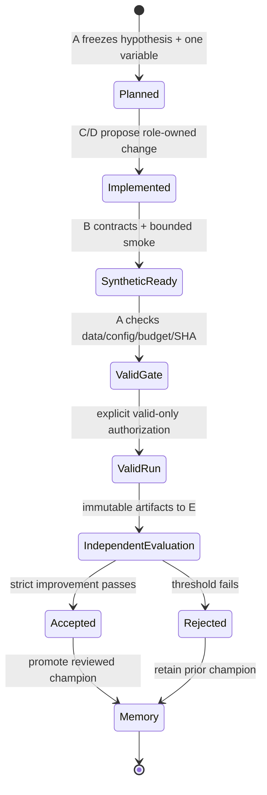
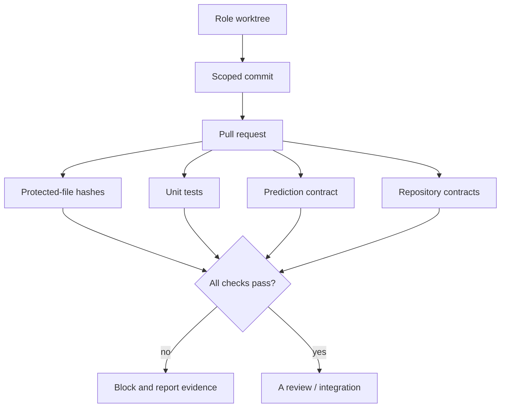
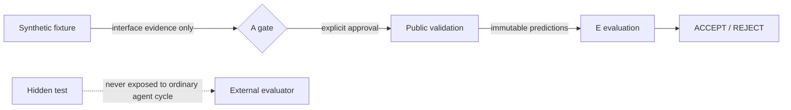

# BOB-Agent architecture

BOB-Agent is a five-role experiment control plane for within-user recommendation
ranking. It separates scientific proposal, implementation, execution, and evaluation
so that no single role can silently change the question and grade its own answer.

## Roles and write authority

| Role | Owns | Must not do |
| --- | --- | --- |
| A — Controller | Experiment specifications, approvals, governance, CI, config promotion, integration | Implement or evaluate its own research change |
| B — Harness & reliability | Runner, preflight, validators, manifests, approved-run execution, retry/rollback, tests | Approve its own config or alter scientific scope |
| C — Data & features | Data contracts, leakage review, feature definitions/proposals | Change model/training or evaluation logic |
| D — Models & training | Models, objectives, sampling, training loops, checkpoints/proposals | Change data boundaries or official evaluation |
| E — Independent evaluator | Immutable prediction audit, metric verification, evaluation evidence, release gate | Train models, alter outputs, or approve its own exception |

Role proposals and evidence enter through `coordination/inbox/<ROLE>/`. A integrates
reviewed work through pull requests. Cross-role substitutions are exceptional,
explicitly human-authorized, recorded in `governance/manual_interventions.jsonl`, and
do not impersonate or replace an independent review.

## State and evidence flow

The repository records the current state in `coordination/current_state.json`, the
active/completed experiment in `coordination/current_experiment.json`, and append-only
decisions in `coordination/experiment_history.jsonl`. The agent-cycle coordinator
reads these files and dispatches only the legal `next_receiver`.

## Experiment contract

The fixed task is to rank items within each user using `long_view`. Validation uses
GAUC and nDCG@5, with their arithmetic mean as the primary score. A proposal freezes:

- one scientific variable;
- approved baseline and candidate configs;
- train/valid-only data boundary and date cap;
- seed and training budget;
- strict improvement rule;
- full Git SHA and evidence paths.

Missing or inconsistent fields fail closed. Scientific decisions use validation only.

## Pull-request and CI gate

The four named Actions checks are evidence, while repository administrators remain
responsible for enforcing branch protection. Protected paths and manual-intervention
conditions remain human-reviewed even when ordinary PR monitoring is automated.

## Small evidence and large artifacts

Small contracts, hashes, decisions, and readiness notes are committed through role
PRs. Data, predictions, checkpoints, generated metrics packages, and run artifacts
are never committed.

For a large handoff, the coordinator inventories every byte, records its relative
path, size, and SHA-256, and marks the manifest for manual private transfer. The
receiver recomputes hashes before use. This gives Git a reviewable chain of custody
without turning the repository into artifact storage.

## Synthetic, public-valid, and hidden-test boundaries

- **Synthetic:** bounded smoke for operability; it is never metric evidence.
- **Public validation:** the only source for research selection and champion updates.
  One-step mode requires a recorded gate and explicit B invocation flag. Continuous
  mode requires that same experiment gate plus A's bounded campaign authorization;
  only then may it grant B public-valid execution and E independent valid evaluation.
- **Hidden test:** ordinary orchestration never accesses or scores it. Final submission
  is designed for external evaluation after a human freezes the commit, config, and
  artifact hashes.

The repository contains protected starter interfaces, so the claim is deliberately
about the orchestrated workflow—not physical impossibility for a repository owner.

## Champion and experiment memory

E independently evaluates frozen valid predictions. A applies the predeclared strict
rule and appends the result to experiment memory:

- `exp_001` passed and became the approved champion;
- `exp_002` regressed and was rejected;
- `configs/approved/exp_001.json` therefore remains the champion.

This is the feedback loop: failure becomes structured evidence for the next
hypothesis, without overwriting the best known system.

## Current automation boundary

The coordinator supports `status`, `report`, one-role `step`, bounded continuous
`run`, `watch-pr`, and hashed `handoff`. `run --max-iterations N` is accepted only on
a clean `main` checkout and cannot exceed A's recorded experiment or role-step limits.
Every role still produces a separate clean commit and matching PR; the runner checks
role ownership, the four CI gates, mergeability, protected paths, and fresh canonical
state before advancing.

Continuous mode can automatically advance a valid-only campaign, including B and E
when both the experiment gate and A authorization allow it. It records a resumable,
fail-closed stop when a role waits/fails, a PR or check is unsafe, a private artifact
transfer is required, A-owned routing state does not advance, authorization changes,
or a configured stopping rule is reached. Hidden-test access and final approval are
never part of an ordinary campaign. This is bounded automation with explicit stop and
resume points, not absolute unattended execution.
